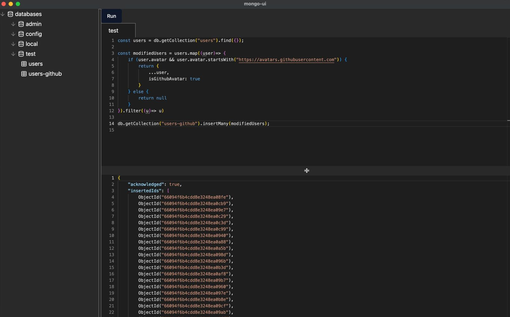

# MongoDB GUI with Native JavaScript Interpreter

Ever wished for a seamless MongoDB GUI experience, with the flexibility to execute JavaScript right within the interface? Well, look no further! 🌟

## Overview

This project is a MongoDB GUI built using [Tauri](https://tauri.app/), a rust framework for building native apps using web technologies. The frontend is written in **React**.
What makes this GUI stand out is the integration of a native JavaScript interpreter, powered by the [Boa](https://github.com/boa-dev/boa) engine (a JavaScript engine written in Rust).

With this tool, you can write and execute JavaScript code directly within the GUI, making your MongoDB operations more efficient and intuitive.
The integrated [Monaco Editor](https://microsoft.github.io/monaco-editor/) enhances the coding experience by providing excellent JavaScript support, including code completions and more.

## Features

- **Seamless MongoDB GUI**: User-friendly interface for managing your MongoDB databases.
- **Native JavaScript Interpreter**: Execute JavaScript code directly within the GUI using the Boa engine.
- **Monaco Editor Integration**: Enjoy features like code completion, syntax highlighting, and more.

## Screenshots



## Installation

To get started with this project, follow these steps:

1. **Clone the Repository**:

   ```sh
   git clone https://github.com/Aman-14/mongo-ui
   cd mongo-ui
   ```

2. **Install Dependencies**:
   Make sure you have Rust and Node.js installed on your system. Then, install the necessary dependencies:

   ```sh
   npm install
   ```

3. **Build and Run**:
   Build and run the application:
   ```sh
   npm run tauri dev
   ```

_Crafted with love and Rust._
